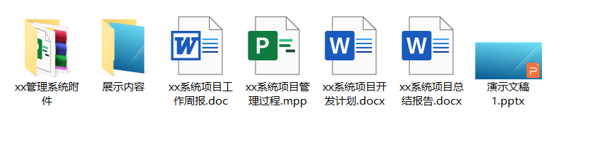
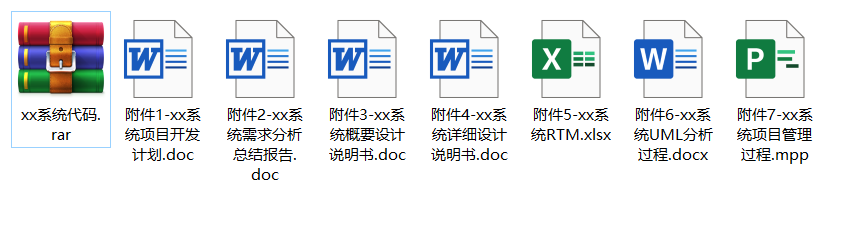

第一次开会大纲
===

人员&分工
---

* 张钧博：组长, TM
* 程嘉诚：TL
* 林沛媛：PM
* 张卓凡：TM

干系人
---

交付物
---

* 需求
  
    1. 需求分析总结报告

* 设计

    1. 概要设计说明书
    2. 详细设计说明书
    3. RTM
    4. UML

* 编码

    1. 代码

* 测试

* 交付

    1. 附件
    2. 展示内容
    3. 演示文稿.ppt

* 其他

    1. 工作周报.doc
    2. 管理过程.mpp
    3. 开发计划.doc
    4. 总结报告.doc

  
  

## 瞎扯

1. 西大网盘，使用校园内网达到提升上传下载速度的作用。
2. 固定域名。建议 cloud.nwu.edu.cn ，但是与官方域名重名，所以要做出少许更改，要求能从域名看出该网站是学校所属云盘的试验版本。
3. https协议。
4. 凭本人*工作证号*或*学号*，经西大官方统一身份认证平台授权登录 <http://authserver.nwu.edu.cn/authserver/login> ，即可**激活**使用云盘服务，无需注册。
5. 首次激活使用时，用户须同意《西北大学云盘服务用户条款》
6. 制定《西北大学云盘服务用户条款》（项目管理加分项）