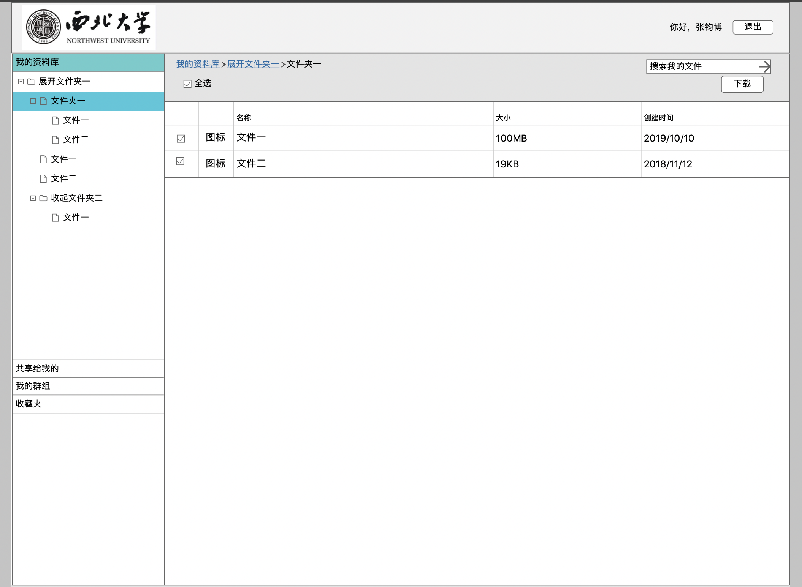

# 需求

## 必要功能

* 登录
  
1. 预留OAuth协议登录接口（如西北大学统一身份认证，QQ登录）
  
* 文件功能细节

  

  1. 能够以层级方式查看所有文件夹
  2. 能够显示文件夹中的文件
  3. 每个文件/文件夹可以下载。
  4. 每个文件/文件夹可以共享，得到共享链接。
  5. 每个文件/文件夹可以删除。
  6. 每个文件/文件夹可以重命名。
  7. 能够显示文件/文件夹的常用属性，如大小，创建时间。
  8. 有多选，全选功能。
  9. 整个个人资料库不应超过50G。
  10. 网址/学号为个人主页，如<https://cloud.nwu.edu.cn/2017110048>

## 可选功能

* 文件

  1. 每个可预览文件可以点击预览，如png，txt，cpp，doc，pdf。
  2. 共享可选择公开共享/私密共享
     * 公开共享：访问个人主页即可查看公开共享的文件
     * 私密共享：需得到共享链接才能查看共享的文件
  3. 搜索功能。

* 群组

  1. 群组由发起人，受邀人，群组资料库组成。
  2. 发起人可以邀请其他人进入群组。
  3. 所有人都可以向群组资料库上传文件。
  4. 所有人都可以从群组资料库下载文件。
  5. 所有人都可以在资料库新建文件夹。
  6. 发起人可以删除/重命名群组资料库所有文件。
  7. 受邀人只能删除/重命名自己上传的文件。
  8. 群组资料库大小不应超过500G。
  9. 超过10G的文件只能保存半年。

# 设计

文件夹层级信息如何保存？

* 存储树状结构数据。<https://www.zhihu.com/question/20417447>

* 文件信息不存放在数据库中，直接在系统中读取。

## 数据库设计

* 用户
  1. 用户名（学号）
  2. 已用空间
  3. OAuth token
* 文件
  1. id
  2. 用户名
  3. 路径
  4. 文件名
  5. 文件大小
  6. 创建日期
  7. 扩展名

* 共享
  1. id
  2. 文件id
* 群组